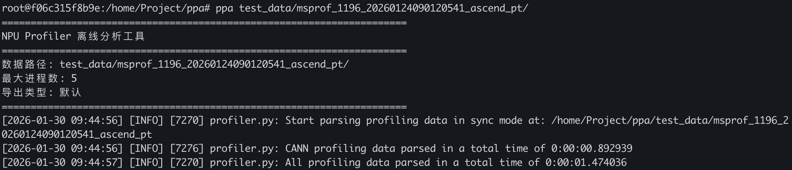

# PPA(Pytorch Profiler Analyzer)

PPA是基于torch_npu profiler的离线分析工具, 目的是解耦torch_npu和msprof对npu环境的依赖, 打包了torch_npu profiler和msprof解析代码, 实现命令行一键解析。



**使用方法**:
- 编译依赖安装
```bash
apt install -y cmake python3 python3-pip ccache autoconf gperf libtool libssl-dev pigz
```


- 安装whl包
```bash
pip install ./dist/ppa-1.0.0-py3-none-any.whl --no-deps
```

- 命令行工具: `ppa`
```bash
# 查看帮助
ppa --help

# 解析路径
ppa /path/to/profiling_data
```


## 限制说明
1. 由于MemoryTimelineParser需要依赖原生torch，使用频率不高，为了最大降低三方依赖，暂时转为空实现。